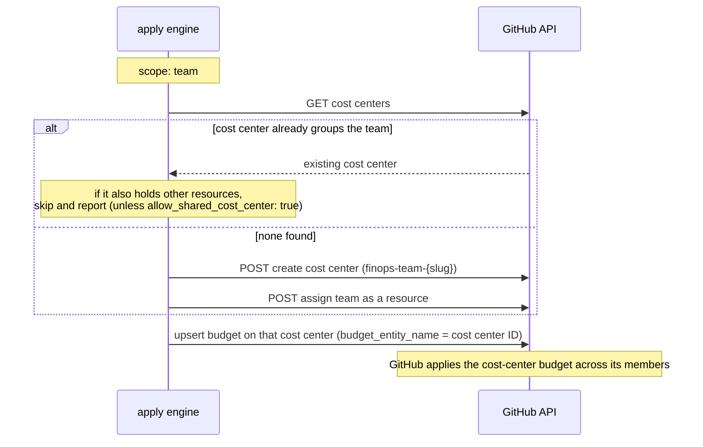
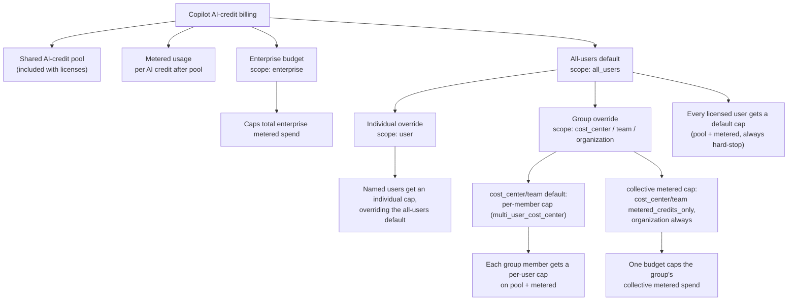
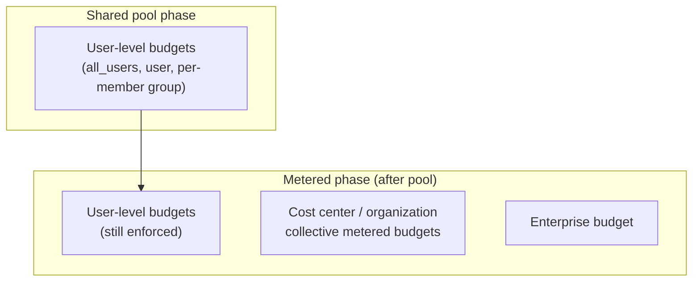
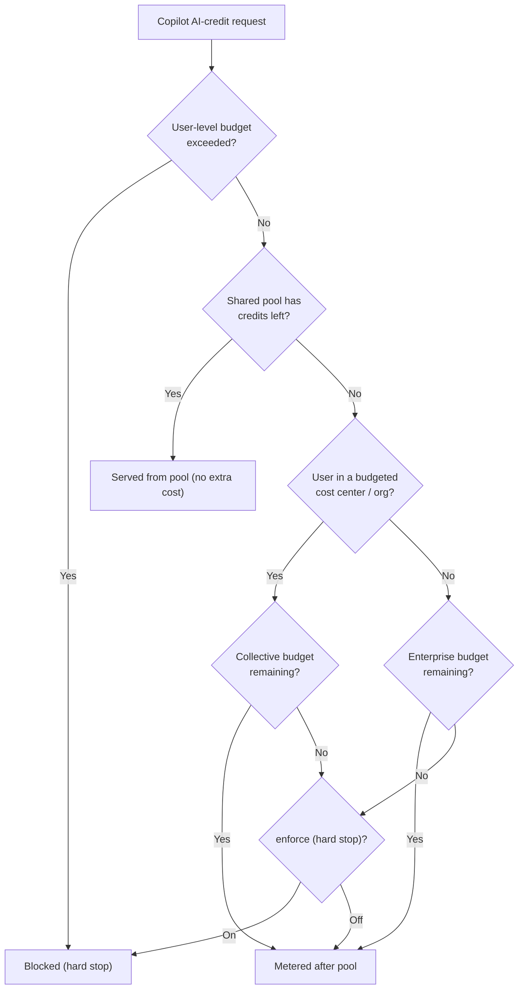

# Workflows

## Reusable v3 action

For a consuming enterprise repo, load this custom task directly from the hosted action repository:

```yaml
uses: amgdy/copilot-finops-automation@v3
```

That repo hosts the FinOps engine. The consuming repo only needs a config file, `COPILOT_FINOPS_ENTERPRISE` variable, `COPILOT_FINOPS_TOKEN` secret, and its workflows. This is simpler than the older fork-the-whole-repo approach and keeps all enterprises on the same reusable v3 engine.

These two workflows are the canonical copies — copy them into your enterprise repo. Ready-to-copy **validate** workflow:

```yaml
name: Copilot FinOps Validate

on:
  pull_request:
    paths:
      - "config/copilot-finops.yml"
  workflow_dispatch:

permissions:
  contents: read

jobs:
  validate:
    runs-on: ubuntu-latest
    steps:
      - uses: actions/checkout@v7
      - uses: amgdy/copilot-finops-automation@v3
        with:
          operation: validate
          config-file: config/copilot-finops.yml
```

Ready-to-copy **apply** workflow:

```yaml
name: Copilot FinOps Apply

on:
  workflow_dispatch:
    inputs:
      dry_run:
        description: Preview only, no writes
        required: false
        default: "true"
      log_level:
        description: Live step log level (off, error, warn, info, debug)
        type: choice
        options:
          - off
          - error
          - warn
          - info
          - debug
        required: false
        default: info
  schedule:
    - cron: "0 6 * * 1"

permissions:
  contents: read

concurrency:
  group: copilot-finops-apply
  cancel-in-progress: false

jobs:
  apply:
    runs-on: ubuntu-latest
    steps:
      - uses: actions/checkout@v7
      - uses: amgdy/copilot-finops-automation@v3
        with:
          operation: apply
          config-file: config/copilot-finops.yml
          enterprise: ${{ vars.COPILOT_FINOPS_ENTERPRISE }}
          token: ${{ secrets.COPILOT_FINOPS_TOKEN }}
          dry-run: ${{ github.event_name == 'schedule' && 'false' || inputs.dry_run }}
          log-level: ${{ github.event_name == 'schedule' && 'info' || inputs.log_level }}
```

The project ships two workflows built on the same Node.js action.

| Workflow | Trigger | Operation | Token |
| --- | --- | --- | --- |
| [`finops-validate.yml`](../.github/workflows/finops-validate.yml) | Pull requests touching `config/**`, `schemas/v3/**`, `src/**`, `dist/**`, `action.yml`; and manual dispatch | `validate` | none |
| [`finops-apply.yml`](../.github/workflows/finops-apply.yml) | Manual dispatch (dry-run by default) + weekly schedule (Mondays 06:00 UTC, live) | `apply` | `admin:enterprise` |

There is a third workflow, [`ci.yml`](../.github/workflows/ci.yml), for development: it runs the test suite and fails if the committed `dist/` bundle or `docs/config-schema.md` is stale.

## Recommended operator flow

1. Edit `config/copilot-finops.yml` and open a pull request. `finops-validate.yml` lints it automatically (no token).
2. Run `finops-apply.yml` manually with `dry_run=true`. The dry-run preview **is** the audit — it lists every CREATE / UPDATE / NO CHANGE without writing.
3. Run it again with `dry_run=false`, or enable the schedule, only after the preview looks right.

For a new public/demo consumer repo, keep the config a no-op (`version: 3` with no `budgets`) until you are ready to connect it to a real enterprise. Keep the schedule disabled in demo repositories that are not connected to a real enterprise — a live run and its job summary can expose operational details once real config is added.

## Inputs

The repository workflows use `config/copilot-finops.yml` by default; the in-repo manual workflows also allow a `config_file` override. `finops-apply.yml` also takes:

- `dry_run` (default `true`) — manual runs preview; the scheduled run forces `dry_run=false`.
- `log_level` (default `info`) — controls live step log detail: `off`, `error`, `warn`, `info`, or `debug`. `info` prints apply progress and the plain-text report; `debug` adds resolution, live-budget matching, payload, request, retry, and pagination details with sensitive fields redacted.
- The enterprise slug comes from the `COPILOT_FINOPS_ENTERPRISE` repository/organization **Variable**, and the token from the `COPILOT_FINOPS_TOKEN` secret. Neither is a config field.

Each run writes a detailed markdown job summary (the rendered report) to `$GITHUB_STEP_SUMMARY`, regardless of `log_level`. At the default `info` level, the live log includes apply progress and the plain-text report; use `warn` or `error` for quieter runs. Treat the summary and any expanded live logs as operational data — they can contain team names, cost center names, budget amounts, and logins.

`log_level` is authoritative for FinOps diagnostics: `[debug]` live-log lines and `DEBUG` entries in the summary's full run log are emitted only when the workflow input is `debug`.

## `finops-validate.yml`

- Runs `operation: validate` against the config file and, in a second step, against `config/copilot-finops.example.yml`.
- Token-free and network-free: it checks the config against the v3 JSON Schema and the semantic rules only.
- Fails the PR check on any invalid config.

## `finops-apply.yml`

- Runs `operation: apply`. Manual runs default to a dry-run; the weekly schedule runs live.
- Applies every budget in config against live enterprise budgets: **CREATE** missing budgets, **UPDATE** changed ones (mutable fields only), leave matching ones unchanged. It **never deletes**.
- For `team` budgets it first resolves (or creates and assigns) the cost center that groups the team. An `organization` budget is written directly (no cost center).

### Scope → GitHub budget

Every budget is written on the enterprise endpoint `POST /enterprises/{enterprise}/settings/billing/budgets`. The config `scope` (plus `metered_credits_only`) selects the GitHub `budget_scope` and the entity field:

| `scope` | `metered_credits_only` | GitHub `budget_scope` | Entity field | Hard-stop |
| --- | --- | --- | --- | --- |
| `all_users` | — (n/a) | `multi_user_customer` | — | always |
| `user` | — (n/a) | `user` × each login | `user` = login | always |
| `cost_center` | `false` (default) | `multi_user_cost_center` | `budget_entity_name` = cost center ID | always |
| `cost_center` | `true` | `cost_center` | `budget_entity_name` = cost center ID | `enforce` (default true) |
| `team` | `false` (default) | `multi_user_cost_center` on the team's cost center | `budget_entity_name` = cost center ID | always |
| `team` | `true` | `cost_center` on the team's cost center | `budget_entity_name` = cost center ID | `enforce` (default true) |
| `organization` | `true` / omit (`false` = per-member, not yet supported) | `organization` (direct, no cost center) | `budget_entity_name` = org login | `enforce` (default true) |
| `enterprise` | — (always metered) | `enterprise` | — | `enforce` (default true) |

Every request body also carries `budget_amount` (whole USD), `budget_product_sku: ai_credits`, `budget_type: BundlePricing`, `prevent_further_usage` (the hard-stop), and `budget_alerting` (`will_alert` + `alert_recipients` from `alerts`).

```mermaid
flowchart TD
  CFG["Budget in config<br/>scope + amount + (metered_credits_only)"] --> SC{"scope?"}

  SC -->|all_users| AU["budget_scope: multi_user_customer<br/>always hard-stop"]
  SC -->|user| US["budget_scope: user &times; N<br/>user = login (hard-stop)"]
  SC -->|enterprise| EN["budget_scope: enterprise<br/>collective metered"]
  SC -->|cost_center| CC{"metered_credits_only?"}
  SC -->|team| TM["resolve / create cost center<br/>+ assign team"]
  SC -->|organization| OR{"metered_credits_only?"}

  CC -->|false| CCU["budget_scope: multi_user_cost_center<br/>entity = cost center ID"]
  CC -->|true| CCM["budget_scope: cost_center<br/>entity = cost center ID"]

  TM --> TMM{"metered_credits_only?"}
  TMM -->|false| TCU["budget_scope: multi_user_cost_center<br/>entity = cost center ID"]
  TMM -->|true| TCM["budget_scope: cost_center<br/>entity = cost center ID"]

  OR -->|"true (required)"| ORM["budget_scope: organization<br/>entity = org login<br/>collective metered"]
  OR -->|false| ORX["per-member org: not yet supported<br/>use enterprise team + scope: team"]

  AU --> EEP["POST /enterprises/&#123;enterprise&#125;/settings/billing/budgets"]
  US --> EEP
  EN --> EEP
  CCU --> EEP
  CCM --> EEP
  TCU --> EEP
  TCM --> EEP
  ORM --> EEP
```



### Reconciliation — CREATE / UPDATE / NO CHANGE

Budgets have no name field, so the engine matches **desired vs. live** state by natural key. It lists existing budgets once, then for each desired budget:

```mermaid
flowchart TD
  M["Each desired budget"] --> L["List existing budgets once"]
  L --> K["Match by natural key:<br/>budget_scope + product_sku<br/>+ (user | budget_entity_name)"]
  K --> Q{"Match found?"}
  Q -->|No| CR["CREATE<br/>POST .../budgets"]
  Q -->|Yes| D{"amount / hard-stop /<br/>alerting differ?"}
  D -->|Yes| PA["UPDATE mutable fields only<br/>PATCH .../budgets/&#123;id&#125;"]
  D -->|No| NC["No change (idempotent)"]
  CR --> SUM["Recorded in the job summary"]
  PA --> SUM
  NC --> SUM
```



> The engine **never deletes** budgets. A budget removed from config is left in place; clean it up manually with `DELETE .../budgets/{budget_id}` after review. In dry-run every branch is computed and printed (`would create` / `would update` / `no change`) but no request is sent.

### Cost center provisioning (team budgets)

A `team` budget is applied through a cost center, without enumerating members (an `organization` budget is written directly and never touches a cost center):



## Billing model reference

### Budget levels tree



### Where each control applies (pool vs metered)



### Per-request billing flow



> "Lowest remaining headroom wins": whichever budget has the least capacity remaining blocks the user first. `enforce` (hard stop) applies to collective metered budgets (`enterprise` or `organization`, and `cost_center`/`team` with `metered_credits_only: true`); user-level budgets always hard-stop.

For the exact API sequence and request bodies, see [API reference](api-reference.md).
